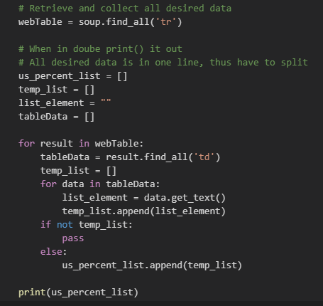
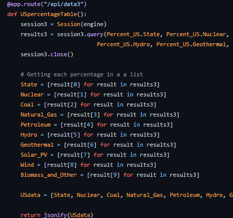
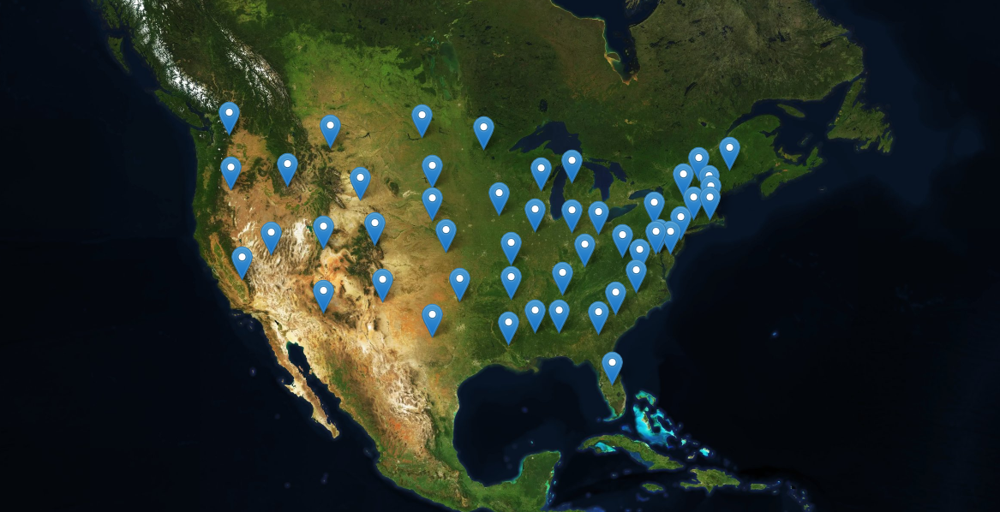
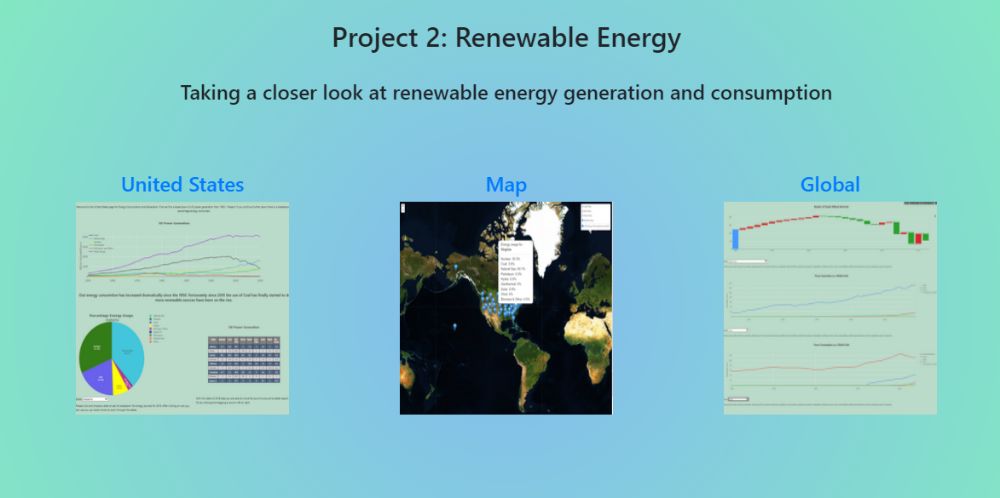
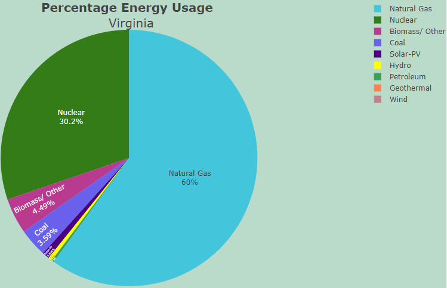

# Energy Consumption and Generation project connected to Heroku

### Create visualizations depicting use of renewable energy to record US efforts and compare to global, showing which states are generating the most renewable energy resources.

 * Web Scraping

 * Includes a Python Flask-powered API, HTML/CSS, JavaScript and SQLite

 * Custom D3.js, a combination of web scraping, Leaflet and Plotly

 * Dashboard Page for quick reference

 * User driver interactions

